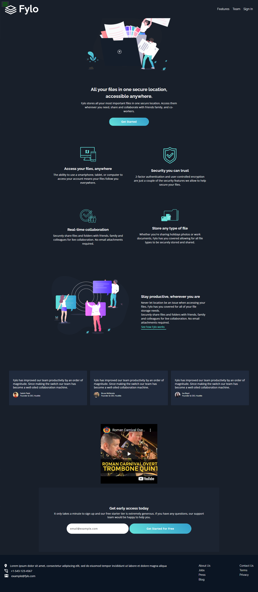

# Frontend Mentor - Fylo dark theme landing page

This is a solution to the [Fylo dark theme landing page challenge on Frontend Mentor](https://www.frontendmentor.io/challenges/fylo-dark-theme-landing-page-5ca5f2d21e82137ec91a50fd). Frontend Mentor challenges help you improve your coding skills by building realistic projects. 

## Table of contents

- [Overview](#overview)
  - [The challenge](#the-challenge)
  - [Screenshot](#screenshot)
  - [Links](#links)
- [My process](#my-process)
  - [Built with](#built-with)
  - [Continued development](#continued-development)
- [Author](#author)

## Overview

### The challenge

Users should be able to:

- View the optimal layout for the site depending on their device's screen size

### Screenshot

### Links

- Solution URL: [URL](https://github.com/nyeno/fylo-landing-page)
- Live Site URL: [Live site URL here](https://nyeno.github.io/fylo-landing-page/)

## My process

### Built with

- Semantic HTML5 markup
- CSS custom properties
- Flexbox
- CSS Grid
- Mobile-first workflow

### What I learned

1. How to use percentages and ems in css to allow for a more responsive feel on different screen sizes.
2. How to make the best use of css grid and flexbox. 

### Continued development

Impementing responsive navigation for different screen sizes.

## Author

- Frontend Mentor - [@nyeno](https://www.frontendmentor.io/profile/nyeno)
- Twitter - [@_laurae](https://www.twitter.com/_laurae)

